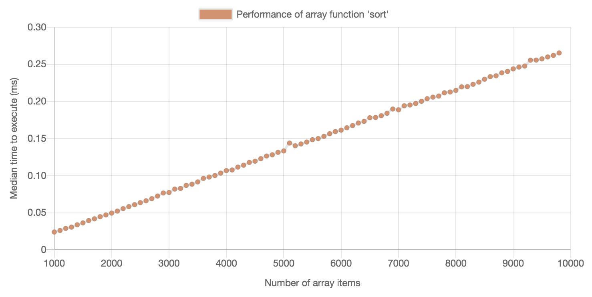
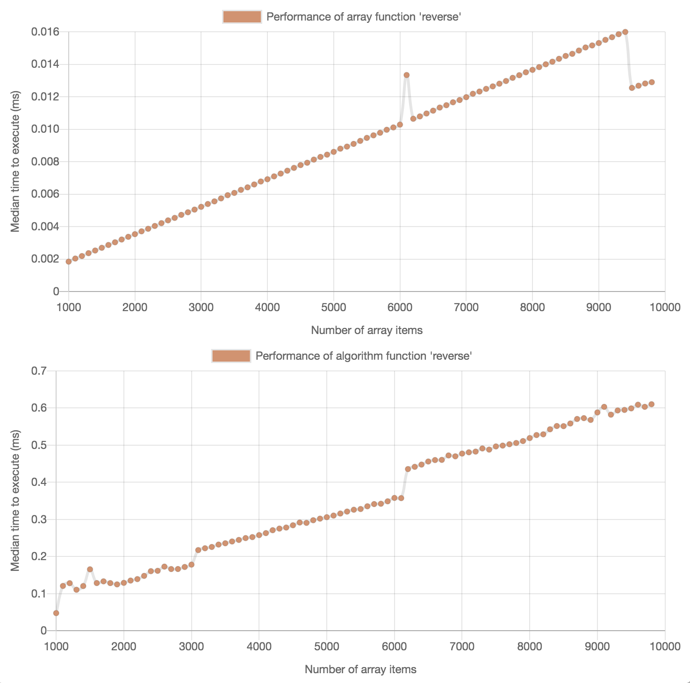
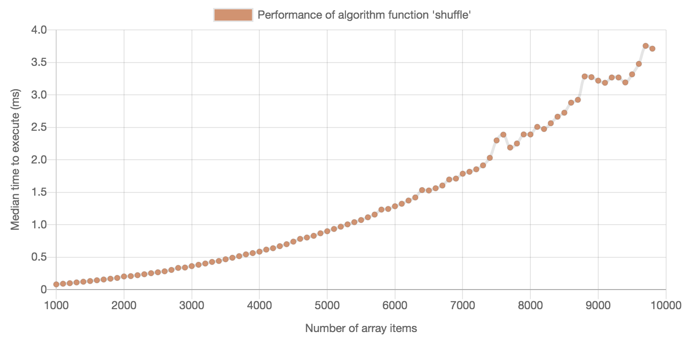
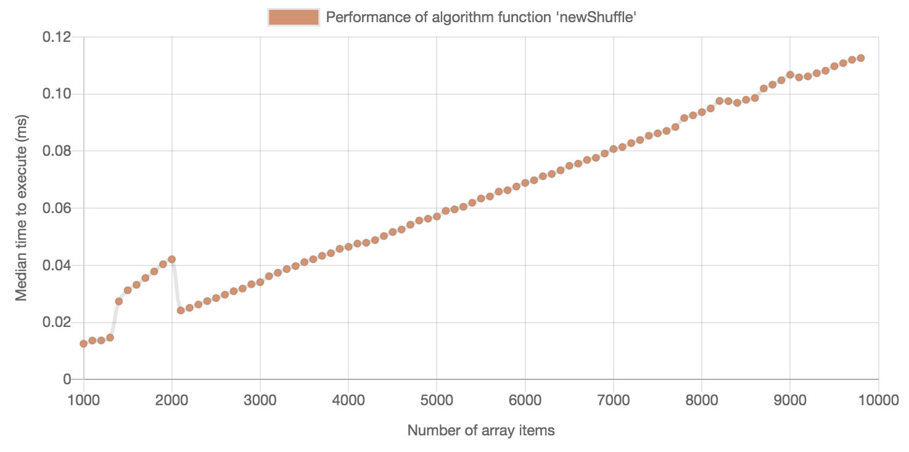

# Algorithms week review

## 1. Graphing stuff

> Using one of the standard library functions (last, reverse, shuffle or sort) describe what the shape of the graph looked like. 



> What does this tell you about how the running time changes as the input size increases?

The running time increases linearly with the input size - **O(n)**


## 2. Reverse implementation

> Please provide a screen-shot of your implementation of `reverse`. 

```javascript
const algorithms = { 
  reverse: function(array) {
  output = []
  array.forEach(function(item, index) {
    output[array.length - 1 - index] = item
  })
  return output
  }
}
```



> How does this compare with the standard library methods from your testing framework? 

Both are approximately linear, although mine is significantly slower and has jumps at certain points

> What is the Big O complexity of your `reverse` method? Could this be more efficient?

It's O(n). It could be more efficient as it's slower than the built-in method. My theory is that putting items into an array at a certain position is inefficient, when doing so will create blank items in the array.


## 3. Big O complexity
> Below are two implementations of method for deciding whether an array contains duplicates:

> What is the Big O run time complexity of each of them?

```javascript
function hasDuplicates(arr) {
  for(let i = 0; i < arr.length; i++) {
    for (let j = i + 1; j < arr.length; i ++) {
      if(arr[i] === arr[j]) {
        return true
      }
    }
  }
```
**O(n<sup>2</sup>)**


```ruby
def hasDuplicates(arr) 
  value_tracker = {}
  i = 0
  has_duplicates = false
  while i < arr.length
    val = arr[i]
    if value_tracker[val]
      has_duplicates = true
      break
    else 
      value_tracker[val] = 1
    end
    i += 1
  end
  return has_duplicates
end
```
**O(n)**

## 4. Algorithm implementation
> Choosing one of the other algorithms on the list describe your implementation and describe the run time of this in Big O notation. 

```javascript
const algorithms = {
  assignStudents: function(students, numGroups) {
    let groups = []
    for(let i = 0; i < numGroups; i++) {
      groups.push([])
    }
    let currentGroup = 0
    students.forEach(function(student, index) {
      groups[currentGroup].push(student)
      currentGroup >= numGroups - 1 ? currentGroup = 0 : currentGroup++
    })
    return groups
  }
}
```
**O(n)** - loops through the students array once (and the number of groups once)

> Is there a way to do better?

Not that I can think of, for this one.

### An example of a less efficient algorithm that I improved
```javascript
const algorithms = {
  shuffle: function(array) {
    let shuffled = []
    let sourceArray = [...array]
    while(sourceArray.length > 0) {
      min = 0;
      max = sourceArray.length - 1;
      pos = Math.floor(Math.random() * (max - min + 1)) + min
      shuffled.push(sourceArray.splice(pos, 1)[0])
    }
    return shuffled
  }
}
```
The graph for this one looked like this: 



This looks like **O(n log n)**

The issue with this appears to be that splicing the sourceArray is not a constant time operation.

Following suggestions from Anthony and the internet, I wrote this algorithm:


```javascript
const algorithms = {
  newShuffle: function(array) {
    let output = [...array]
    let last = array.length - 1
    for(let i = 0; i < array.length; i++) {
      let min = 0
      let pos = Math.floor(Math.random() * (last - min + 1)) + min
      let old = output[i]
      output[i] = output[pos]
      output[pos] = old
    }
    return output
  }
}
```

Graph:



This one looks like **O(n)** and runs much more quickly for large arrays.